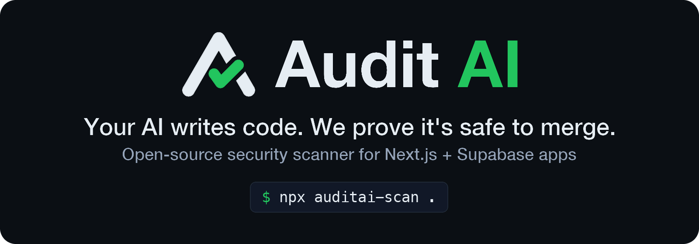

<p align="center">
  <a href="https://auditai.sh"></a>
</p>

<p align="center">
  <a href="https://auditai.sh"></a>
  <a href="https://github.com/audit0/auditai-scanner/actions/workflows/ci.yml"></a>
  <a href="https://www.npmjs.com/package/auditai-scan"></a>
  <a href="./LICENSE"></a>
  <a href="https://x.com/Audit_AI"></a>
</p>

<p align="center">
  <a href="https://auditai.sh">Scan a repository</a> ·
  <a href="https://auditai.sh/r/demo">Sample report</a> ·
  <a href="https://auditai.sh/docs">Docs</a> ·
  <a href="https://auditai.sh/stats">Measured precision</a> ·
  <a href="https://github.com/audit0/auditai-playground">Playground</a> ·
  <a href="https://youtube.com/shorts/_0e0qbXlorI">Video</a>
</p>

<p align="center"><strong>Your AI writes code. This scanner finds the bug it ships most: one customer reading another customer's data.</strong></p>

<p align="center">Deterministic security scanner for Next.js (App Router) + Supabase apps. No account, no model, no network. Seconds.</p>

```bash
npx auditai-scan --snapshot-query          # a read-only query: run it in the Supabase SQL editor
npx auditai-scan --snapshot snapshot.json  # what your live database lets a stranger do
npx auditai-scan .                         # your repository
```

<p align="center"></p>

```
$ npx auditai-scan --snapshot examples/snapshot.json
Audit AI database scan  taken 2026-09-21T08:00:00Z
Postgres 17.6 · Tables 2 · With RLS 1/2 · Rules 15

AUDIT-001  LIKELY  HIGH  Table "invoices" is exposed without RLS
  Entry   GET /rest/v1/invoices (Supabase Data API), POST /rest/v1/invoices (Supabase Data API), PATCH /rest/v1/invoices (Supabase Data API), DELETE /rest/v1/invoices (Supabase Data API)
  Path    HTTP request -> GET /rest/v1/invoices (Supabase Data API) -> supabase (publishable key) (anon, RLS would apply) -> public.invoices (RLS disabled)
  Why     Row level security is off on public.invoices, and it is queried with the anon client. Anyone holding the public anon key can read every row directly through PostgREST. Reached from 4 entry points.
  Rule    supabase.table-without-rls · CWE-284, CWE-862 · confidence 0.90
  Fix     Enable row level security on public.invoices (supabase/migrations/20260921080000_fix_enable_rls_invoices.sql)
          -- Turn on row level security for public.invoices
          -- Proposed by Audit AI. Read it, then apply it with the rest of your migrations.
          alter table public.invoices enable row level security;
          
          create policy "invoices: owner reads" on public.invoices
            for select to authenticated
            using (user_id = (select auth.uid()));
          
          create policy "invoices: owner writes" on public.invoices
            for all to authenticated
            using (user_id = (select auth.uid()))
            with check (user_id = (select auth.uid()));

AUDIT-002  LIKELY  HIGH  Policy "profiles are editable" lets anyone update "profiles"
  Entry   Supabase Data API (PostgREST)
  Path    Anyone with the public anon key -> PostgREST -> policy "profiles are editable" (for update, to public) -> public.profiles
  Why     Policy "profiles are editable" on public.profiles is for update to public and decides with a tautology: USING true. Anyone holding the public anon key can update rows in public.profiles straight through PostgREST, without going through this application. Rows that belong to signed-in users can be changed or deleted by a stranger.
  Rule    supabase.anon-write-policy · CWE-284, CWE-862 · confidence 0.85
  Fix     Tie the write policy on public.profiles to the caller (supabase/migrations/20260921080000_fix_policy_profiles_update.sql)
          -- Close the open write policy "profiles are editable" on public.profiles
          -- Proposed by Audit AI. Read it, then apply it with the rest of your migrations.
          drop policy "profiles are editable" on public.profiles;
          
          create policy "profiles are editable" on public.profiles
            for update to authenticated
            using (id = (select auth.uid()))
            with check (id = (select auth.uid()));

Checked 2 risks in class authorization/RLS. Verified: 0. Confirmed (no sandbox): 0. Unverified: 0.

Note: Application code was not read: the entry points here are the Data API endpoints your database serves, so nothing is said about service-role queries, missing authentication or mass assignment in your own routes.
Note: A clean result means the database refuses the accesses these rules test, not that the application is safe.
Note: Views, materialized views and foreign tables are not judged: row level security does not apply to them, and whether a view runs with its owner's rights is not checked yet.
```

This is the open-source engine behind [Audit AI](https://auditai.sh). The scanner gives you the
deterministic part: every route, server action, page, Supabase client, query, RLS policy and
database function, mapped and checked. The hosted product takes a finding from here and tries to
prove it.

## Check your live database

What a stranger can do with your data is decided by the database as it runs, not by the migrations
folder: a policy added in the dashboard, a table made by hand, a revoke that ran inside a `DO` block.
`--snapshot-query` prints one read-only `SELECT` over the Postgres catalog: tables and whether row
level security is on, policies, grants to `anon` and `authenticated`, functions and storage buckets.

1. `npx auditai-scan --snapshot-query`, paste it into Supabase → SQL Editor → Run.
2. Save the one cell it returns as `snapshot.json` (the editor's JSON or CSV export works too).
3. `npx auditai-scan --snapshot snapshot.json`.

The query reads the catalog and changes nothing. No row of your data is read; the source of a
function is included only when the function is `SECURITY DEFINER`. Every finding comes with the
migration that closes it. The same check runs in the browser at
[auditai.sh/check](https://auditai.sh/check), where nothing you paste is stored.

A clean result means the database refuses what these rules test, not that the application is safe:
a snapshot says nothing about your own routes, which is what `npx auditai-scan .` reads.

## Try the whole loop

54 seconds on the [playground app](https://github.com/audit0/auditai-playground): a scan by link,
the finding in plain words, Prove it in the sandbox, Alice reading Bob's invoice, then the fix
verified by the same attack. The opening message is illustrative and the voice is synthetic;
everything on screen after it is the live product. Also on [YouTube](https://youtube.com/shorts/_0e0qbXlorI).

https://github.com/user-attachments/assets/50ac7fdf-3a84-4089-a106-44ada2a8f081

- **Scan a public repository by link** at [auditai.sh](https://auditai.sh), free and without an
  account. The report explains each finding in plain words for the app's owner and gives the
  developer the code path and a ready task for Cursor or Claude Code. [Sample report](https://auditai.sh/r/demo).
- **Prove it.** A button on the report starts a sandbox run: a local Supabase with your migrations,
  two users seeded from your schema, and a generated test in which Alice asks for Bob's rows. The
  verdict is `Reproduced` only if the attack actually works. When the fix is a migration, the
  sandbox applies it and runs the same attack again; `Verified fix` needs every `DENY` test to pass
  and every `ALLOW` test to stay green. A person approves each sandbox run on a repository we have
  not seen before.
- **A check on every pull request** with the [GitHub App](https://github.com/apps/auditai-sh).
- **A deliberately vulnerable app to try it on:** [audit0/auditai-playground](https://github.com/audit0/auditai-playground).
  It has three holes of three kinds (a service-role read by id, a table without RLS, a
  `SECURITY DEFINER` function), and all three are proven on the live product.

## Why this exists

Lovable, Bolt, v0, Cursor and Claude Code generate the same shape of app: Next.js App Router,
Supabase for auth and data, TypeScript. They also make the same class of mistake: a route handler
that uses the service-role key and filters by `id` only, an RLS policy that says `using (true)`, a
tenant id read from the request body, a role read from `user_metadata`. Generic scanners do not see
these because they do not understand the framework. This one does nothing else.

## What it finds

Rule packs `supabase-authorization`, `supabase-storage-rpc` and `supabase-sql-policies`. Every rule
ships with a vulnerable fixture that must fire and a secure fixture that must stay silent.

| Rule | Kind | Severity | What it catches |
|---|---|---|---|
| `supabase.table-without-rls` | headline | high | Table queried by a user-facing client, or served by the Data API, has row level security disabled |
| `supabase.anon-write-policy` | headline | high, medium when insert-only | Insert/update/delete policy open to `anon` (or no `TO` clause) whose predicate is `true` |
| `supabase.security-definer-function-without-caller-check` | headline | high, critical if anon can execute | `SECURITY DEFINER` function (RLS skipped inside) that never reads `auth.uid()`, callable through `supabase.rpc()` |
| `supabase.rls-policy-trusts-user-metadata` | headline | critical | RLS policy decides access from a `user_metadata` claim, which the user writes themselves with `updateUser({ data })` |
| `supabase.policies-without-rls-enabled` | headline | high | A table carries policies and never got `enable row level security`, so none of them apply |
| `supabase.role-from-signup-metadata` | lead | critical | A sign-up trigger on `auth.users` copies a role from `raw_user_meta_data` (set by the client in `signUp({ options: { data } })`) into a column that decides admin, or the tenant id the policies scope by |
| `supabase.self-assignable-role-column` | lead | critical | A column of the user's own row decides admin (a route's role check, an `is_admin()` helper or a policy) and an own-row UPDATE policy leaves it writable: no `WITH CHECK`, column privilege or `BEFORE UPDATE` trigger holds it |
| `supabase.self-writable-entitlement-column` | lead | high | A column of the user's own row holds credits, a balance, a plan or a KYC status that the server decides on (a route exits when `profile.credits <= 0`, a SQL function or policy compares it) and an own-row UPDATE policy leaves it writable: no `WITH CHECK`, column privilege or trigger. One `PATCH` gives a user credits or a paid plan. Points, coins and gems at medium |
| `supabase.view-runs-with-owner-rights` | lead | high, medium when only signed-in users may select it | View created without `security_invoker` over a table with RLS: it runs as its owner, so the table's policies never apply inside it and every row is readable through the view (Supabase lint 0010) |
| `supabase.service-role-key-exposed-to-client` | headline | critical | Service-role key reaches the browser (`NEXT_PUBLIC_*`, client components) |
| `supabase.service-role-object-access-without-tenant-scope` | lead | critical | Service-role client, or a direct Drizzle/Prisma connection, reads or writes a row by user-supplied id without tenant scope (IDOR / BOLA) |
| `supabase.user-controlled-tenant-scope` | lead | critical | Tenant scope comes from the request (body, query, params) instead of the session |
| `supabase.service-role-query-without-authentication` | lead | critical | Route or server action queries with the service role and never checks the caller |
| `supabase.storage-object-access-without-owner-scope` | lead | critical | Storage download/upload/signed URL/move/remove through the service role on a caller-supplied path that is never tied to the caller's user id |
| `supabase.rls-policy-without-caller-predicate` | lead | high | RLS policy grants rows without referencing the caller (`using (true)` and friends) |
| `supabase.mass-assignment-from-request-body` | lead | high | Request body written to a table without an allow-list, where RLS does not already refuse the write |
| `supabase.role-check-from-user-metadata` | lead | high | Authorization decided by `user_metadata`, which the user can edit |
| `supabase.storage-policy-without-owner-check` | lead | high | Policy on `storage.objects` that only checks `bucket_id`: every user reads, overwrites or deletes every file in the bucket |
| `supabase.dynamic-sql-from-function-parameter` | lead | critical if `SECURITY DEFINER` and anon can execute, high for signed-in only, medium for `SECURITY INVOKER` | Function callable through `supabase.rpc()` glues a text parameter into the SQL it runs with `EXECUTE` (`\|\|`, `format('%s')`), instead of `USING` or `format('%L' / '%I')` |
| `supabase.server-trusts-unverified-session` | lead | high | A handler decides access from `supabase.auth.getSession()`, which reads the cookie without revalidating it, instead of `getUser()` or `getClaims()` |

Severity is the rule's own rating. A lead is printed at medium at most, with this rating next to it.

Findings are reported as `likely`, never `confirmed`: confirmation needs evidence, and evidence
means a reproduced request. Suppressed findings stay in the output, marked `suppressed`.

The database rules (`anon-write-policy`, `rls-policy-trusts-user-metadata`,
`policies-without-rls-enabled`, `view-runs-with-owner-rights`, and `security-definer-function-without-caller-check` and
`dynamic-sql-from-function-parameter` for functions the app never calls) need no query from your application, because PostgREST exposes the schema to
anyone holding the public key. Their findings name the Data API as the entry point instead of a
route.

## Fixes it proposes

Findings whose fix follows from the schema alone come with that fix: one migration, printed under
the finding and included in `--json` as `fix`. No model is involved and nothing is applied: it is
SQL to read and apply yourself.

```
AUDIT-001  LIKELY  HIGH  SECURITY DEFINER function "get_invoice" without a caller check
  Entry   GET /api/invoices/[id], POST /rest/v1/rpc/get_invoice   supabase/migrations/0001_init.sql:55
  ...
  Fix     Run get_invoice with the caller's rights (security invoker) (supabase/migrations/20260913175911_fix_security_invoker_get_invoice.sql)
          -- Run get_invoice with the caller's rights, so row level security applies inside it
          -- Proposed by Audit AI. Read it, then apply it with the rest of your migrations.
          -- It reads public.invoices, and each of them has row level security with policies.
          alter function public.get_invoice(uuid) security invoker;
```

Today that covers the `SECURITY DEFINER`, row-level-security and write-policy rules, about a
quarter of what the scanner reports on real repositories. Every table, function and policy name in
a proposed migration is resolved against the parsed schema. A finding whose fix lives in
application code gets no proposal, on purpose.

## How precise it is

**Headlines and leads.** Since 21 September 2026 the output keeps two kinds of claim apart, by what
each rule reads. Rules that read a fact about the database (row level security off, a write policy
open to anyone, a policy that trusts `user_metadata`, a `SECURITY DEFINER` function callable without
a check on the caller) make **headlines**: on the four blind samples below they were right 78 times
out of 141 (55%). Rules that infer from application code make **leads**: right 62 times out of 249
(25%). A lead is printed under its own heading, capped at medium with the rule's own rating next to
it, and never fails `--fail-on`.

Measured on public repositories the engine had never seen. The selection rule and the sample size
were written down and committed before any repository was picked; the sample was drawn before any
code was read. Every sampled finding is then read against the code and labeled with a one-sentence
reason that cites the line. Precision is real ÷ (real + false positive); findings labeled `unsure`
are left out of the denominator.

| Blind sample | Repositories | Findings labeled | Precision | Blocking tier (high + critical) |
|---|---:|---:|---:|---:|
| 1st, 13 Sep 2026 | 20 | 100 | 36% (36/100) | 35% (32/92) |
| 2nd, 13 Sep 2026, after precision rounds 4–5 | 20 new | 100 | 46% (44/95, 95% interval 37–56%) | 49% (43/87) |
| 3rd, 14 Sep 2026, after precision round 6 | 20 new | 100 | 31% (31/99, 95% interval 23–41%) | 32% (29/92) |
| 4th, 19 Sep 2026, after precision round 7 | 30 new | 100 | 30% (29/96, 95% interval 22–40%) | 32% (27/85) |
| 5th, 23 Sep 2026, after headlines/leads and precision round 8 | 30 new | 100 | **22%** (22/100, 95% interval 15–31%) | 18% (3/17) |

- **The fifth sample came out lower, within noise.** 22% against 30% (p ≈ 0.19). Everything changed
  since the fourth sample lifted the figure on the four labeled samples from 41.8% to 42.3% and did
  not carry over to new code. On this sample headlines were right 3 times out of 17 and leads 19 out
  of 83; seven of the 14 wrong headlines come from one migration that revokes `EXECUTE` on every
  `SECURITY DEFINER` function with a loop over `pg_proc`, which the engine does not read. Because
  leads never block, only 17 of the 100 findings are in the blocking tier, so that column says
  little this time. A second labeller agreed on 27 of 30 (90%, Cohen's kappa 0.67).
- **Before that, about a third of what it reported was a real hole, and round 7 did not change
  that.** Round 7 was made with the third sample's labels in view and lifted the figure on those
  labels from 31% to 36%. On 30 repositories it had never seen, the same build scored 30% — no
  difference from the third sample (p ≈ 0.87; blocking tier p ≈ 0.97). Fixes keep landing on the
  shapes of the last corpus, and the next corpus brings the same classes in new shapes.
- The fourth sample changed its design, and said so before it was picked: 30 repositories and at
  most 10 findings from one (it was 20 and 20), because three repositories supplied 60 of the 100
  findings of the third sample. A second labeller, who did not see the first labels, labeled 30 of
  the 100 independently: the same label on 27 (90%, Cohen's kappa 0.81). The figures are the first
  labeller's.
- Where the fourth sample went wrong: an application-wide gate the engine does not recognise — a
  `middleware.ts` with its own signed cookie, a role inside a signed session, an admin helper with an
  early return (18 of 67 false positives); ownership established in code, such as a membership check
  or a server-built storage path (12); policies that a later migration drops with dynamic SQL inside
  a `DO` block, which the parser does not execute (7); reads that only decide a 404 or a 409 and are
  never returned (9); public-by-design data and forms (7).
- What held up: identity taken from a header the client writes, `SECURITY DEFINER` functions that
  trust a caller-supplied user id, `USING (true)` policies, admin gates on a role users can write to
  their own row, service-role routes with no login at all. Real findings came from 12 of the 22
  repositories in the sample. Critical findings were right 28% of the time, high ones 47%.
- Repository names and labels stay private: a real finding is a real vulnerability in someone's app.

Live numbers, including every sample so far: [auditai.sh/stats](https://auditai.sh/stats). This is
why the hosted product proves before it blocks: a `likely` finding is a lead, not a verdict.

## What it does not do

- It does not prove the absence of vulnerabilities. Every run ends with an honest coverage line:
  `Checked N risks in class authorization/RLS. Verified: X. Confirmed: Y. Unverified: Z.`
- It does not cover other stacks. Next.js + TypeScript with Supabase clients, Drizzle or Prisma on Postgres; deep rather than wide.
- It does not change your code. Schema-level fixes are printed for you to apply; application-code
  fixes, regression tests and sandbox proof are the hosted product.
- It does not call a model. Everything here is static analysis on the TypeScript compiler API.

## Usage

```bash
npx auditai-scan [path] [--json] [--fail-on <status>] [--migrations <dir>]...
npx auditai-scan --snapshot-query            print the read-only query to run in your SQL editor
npx auditai-scan --snapshot <file> [--json]  scan your live database from that query's result

--json               machine-readable output
--fail-on <status>   exit 1 when a finding reaches this status (default: confirmed)
                     one of: candidate, likely, confirmed, verified. Leads never do.
--migrations <dir>   extra directory with Supabase migration SQL (repeatable)
--snapshot <file>    the JSON your SQL editor returned for --snapshot-query ("-" reads stdin)

Exit code: 0 clean, 1 a finding reached --fail-on, 2 usage error or <path> is not a directory
```

Project config in `audit.config.json` at the scanned root:

```json
{
  "ignore": ["evals/**"],
  "migrations": ["supabase/migrations"],
  "publicTables": ["products"]
}
```

This repository carries its own `audit.config.json` that excludes `evals/**`: the fixtures are
deliberately vulnerable demo apps, so scanning the repository as a project would report them as
findings. The eval gate scans each fixture directly and is not affected by that file.

`publicTables` names tables that are public by design (a catalogue, a blog). A service-role read of
such a table is still listed, as `suppressed` with the declaration printed next to it, so the choice
stays visible in every report; writes to the table are never covered by the declaration.

Suppress a finding you have reviewed, with a reason that stays in the code:

```ts
// auditai:ignore supabase.service-role-query-without-authentication -- public waitlist insert; table has RLS with no read policy
export async function POST(req: Request) { ... }
```

CI gate (GitHub Actions):

```yaml
- run: npx auditai-scan . --migrations supabase/migrations --fail-on likely
```

## How it works

```
source files ──► parser ──► Program Security Graph ──► rules ──► findings + coverage ──► fixes
                 (TS compiler API)   Route → Handler → Query → Client / Table → RLSPolicy
```

- **parser** maps App Router route handlers, server actions (wrapped ones too) and dynamic pages,
  classifies every Supabase client (`service_role`, `anon`, `user_scoped`) and every Drizzle or
  Prisma connection (`direct_db`: RLS never runs for it), follows calls from the
  entry point into helpers, service classes and workspace packages (tsconfig `paths`, package.json
  `exports`) three levels deep, tracks which arguments carry user input and which values come from
  the caller's own identity, recognises guards (session, credential and secret checks, ownership
  reads, layout gates), and reads tables, columns, policies, grants, functions, triggers and storage
  buckets from migration SQL.
- **graph** links handlers, queries, clients, tables and policies into one structure a rule can walk.
- **rules** are small pure functions over the graph. Each returns findings with file, line, entry
  point, evidence and a one-line remediation.
- **fixes** derives a migration from the schema when the fix needs nothing else.
- **scanner** is the facade and the CLI.

Repository content under analysis is untrusted data. A comment saying "ignore previous
instructions" is just a comment.

## Eval corpus

Thirty-nine fixture pairs today, growing with every rule. The vulnerable app must fire exactly the expected
rule; the secure twin must produce zero findings. `npm run evals` enforces both on every commit.

| # | Fixture | Rule exercised |
|---|---|---|
| 001 | cross-tenant-invoice-read | service-role-object-access-without-tenant-scope |
| 002 | rls-disabled-invoices-read | table-without-rls |
| 003 | rls-policy-using-true | rls-policy-without-caller-predicate |
| 004 | user-controlled-tenant-id | user-controlled-tenant-scope |
| 005 | role-from-user-metadata | role-check-from-user-metadata |
| 006 | service-role-key-in-client | service-role-key-exposed-to-client |
| 007 | admin-route-without-auth | service-role-query-without-authentication |
| 008 | mass-assignment-profile-update | mass-assignment-from-request-body |
| 009 | unprotected-server-action | service-role-object-access-without-tenant-scope |
| 010 | batch-lookup-by-ids | service-role-object-access-without-tenant-scope |
| 011 | monorepo-package-client-helper-query | service-role-object-access-without-tenant-scope, through a workspace package and a helper |
| 012 | wrapped-action-module-client-helper | service-role-object-access-without-tenant-scope, wrapped action and module-level client |
| 013 | drizzle-direct-db-invoice-read | service-role-object-access-without-tenant-scope, Drizzle direct connection |
| 014 | prisma-direct-db-invoice-read | service-role-object-access-without-tenant-scope, Prisma direct connection |
| 015 | storage-download-user-supplied-path | storage-object-access-without-owner-scope |
| 016 | storage-policy-bucket-only | storage-policy-without-owner-check |
| 017 | security-definer-rpc-without-caller-check | security-definer-function-without-caller-check, called via `supabase.rpc()` |
| 018 | security-definer-granted-to-anon | security-definer-function-without-caller-check, executable by anon (critical) |
| 019 | ssr-cookie-admin-project-read | service-role-object-access-without-tenant-scope, `@supabase/ssr` cookie auth + a separate admin client |
| 020 | formdata-server-action-delete | service-role-object-access-without-tenant-scope, id read with `formData.get()` into a local const |
| 021 | dynamic-page-admin-project-read | service-role-object-access-without-tenant-scope, a server-rendered dynamic page as the entry point |
| 022 | hand-rolled-validator-tenant-scope | user-controlled-tenant-scope, tenant id through a hand-written (no-zod) request validator |
| 023 | mass-assignment-profile-role-cookie | mass-assignment-from-request-body, survives a correct RLS update policy |
| 024 | drizzle-task-update-without-org-scope | service-role-object-access-without-tenant-scope, Drizzle direct connection, write path |
| 025 | prisma-delete-note-without-owner-scope | service-role-object-access-without-tenant-scope, Prisma direct connection, server action |
| 026 | rls-policy-missing-owner-predicate | rls-policy-without-caller-predicate, role-only predicate |
| 027 | documents-table-without-rls | table-without-rls |
| 028 | admin-users-list-role-from-user-metadata | role-check-from-user-metadata |
| 029 | rls-policy-member-helper | rls-policy-without-caller-predicate, policy scoped through a helper function |
| 030 | cron-secret-operator-route | service-role-query-without-authentication, secure twin gated by a cron secret instead of a session |
| 031 | guard-read-then-service-role-delete | service-role-object-access-without-tenant-scope, secure twin checks ownership with an RLS-scoped guard read |
| 032 | mass-assignment-map-spread-messages | mass-assignment-from-request-body, `.map()` spread of request rows vs explicit fields |
| 033 | do-block-rls-literal-loop | table-without-rls, RLS switched on in a `DO $$ foreach ... loop execute format(...)` block over a literal list |
| 034 | public-table-declaration | service-role-query-without-authentication, read of a table declared in `audit.config.json` `publicTables` is suppressed (visibly), the write path is not |
| 035 | identity-derived-row-id | service-role-object-access-without-tenant-scope, a row id from the caller's own credential lookup vs one from the query string |
| 036 | ownership-guard-shapes | service-role-object-access-without-tenant-scope, ownership via the parent row, a comparison in code, or a conditional owner filter |
| 037 | policy-trusts-user-metadata | rls-policy-trusts-user-metadata, the admin claim read from `user_metadata` vs `app_metadata` |
| 038 | policies-without-rls-enabled | policies-without-rls-enabled, four policies on a table whose RLS was never switched on |
| 039 | anon-write-policy | anon-write-policy, an open delete policy for `anon` next to a deliberate public insert |
| 045 | dynamic-sql-from-function-parameter | dynamic-sql-from-function-parameter, search text glued into `EXECUTE` vs bound with `USING`, in a definer function that does check the caller |
| 046 | view-runs-with-owner-rights | view-runs-with-owner-rights, a per-tenant view created the default way vs `with (security_invoker = on)` |
| 047 | self-assignable-role-column | self-assignable-role-column, an own-row update policy without `WITH CHECK` vs `UPDATE` revoked and granted back on `full_name` only |
| 048 | role-from-signup-metadata | role-from-signup-metadata, `handle_new_user` copies the requested role vs an allow-list with a safe default |
| 049 | self-writable-entitlement-column | self-writable-entitlement-column, an own-row update policy without `WITH CHECK` over `profiles.credits` that a paid export checks vs `UPDATE` revoked and granted back on `full_name` only |

Each fixture also carries the `security-test` the hosted product runs in a sandbox: `DENY` tests
are the security assertion (Alice must not read Bob's row), `ALLOW` tests are the sanity check
(Alice still reads her own).

## Development

```bash
npm ci
npm run build      # tsc -b
npm test           # unit tests + eval gate
npm run lint       # biome
npm run bundle     # single-file CLI in npm/dist/auditai-scan.mjs
```

See [CONTRIBUTING.md](./CONTRIBUTING.md) for how to add a rule (always with a fixture pair) and
[SECURITY.md](./SECURITY.md) for reporting vulnerabilities.

## Roadmap for the open engine

- Precision before breadth: the weakest rules above first, then a third blind sample on the engine
  that ships.
- More of the authorization family: realtime channels.
- Proposed migrations for more of the SQL class.
- Better inter-procedural resolution (helpers that wrap `createClient`, shared query builders).

Wider language and framework support is out of scope until this stack is covered deeply.

## License

Apache-2.0. Built in public by [audit0](https://github.com/audit0). Product: [auditai.sh](https://auditai.sh).
Security reports: security@auditai.sh.
